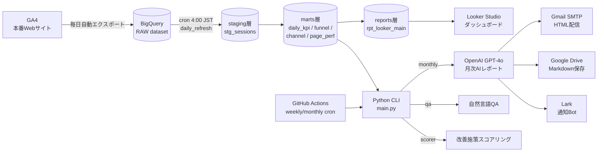

# Case 02: GA4 × BigQuery × AI 分析基盤

## 案件概要

| 項目 | 内容 |
|------|------|
| クライアント | BtoB事業会社A社様（業種非公開） |
| 受注経路 | クラウドソーシングPF |
| 金額 | 受注¥98,000（運用継続中・追加対応も都度実施） |
| 課題 | GA4の数値を毎月手動で集計しており、AI観点でのインサイト抽出が属人化 |
| 提供価値 | GA4 → BQ → AI分析 → 月次/週次レポート自動配信の一気通貫基盤 |

## システム構成図

## 技術スタック

| レイヤ | 技術 |
|-------|------|
| 計測 | GA4（自動BQエクスポート設定） |
| データ基盤 | BigQuery（RAW / staging / marts / reports の4層構造） |
| AI分析 | OpenAI GPT-4o（executive要約・ops施策提案・自然言語QA） |
| 配信 | Gmail SMTP（HTML） / Google Drive（Markdown） / Lark Bot通知 |
| ダッシュボード | Looker Studio（rpt_looker_main 接続） |
| 実行基盤 | GitHub Actions（weekly: 毎週月曜 9:00 JST / monthly: 毎月1日 9:00 JST） |
| 認証 | GCP Service Account |
| 言語 | Python 3.11 |

## 設計上のポイント

- **4層構造（RAW → staging → marts → reports）**: dbt風の責務分離。RAW を直接参照せず、staging で型整形・品質チェック、marts で集計、reports でBI接続用整形。後続の追加要件（チャネル別・ファネル別・ページ別）にも横展開しやすい
- **AI レポートの2層プロンプト**: Executive（経営層向け800トークン）と Ops（実務者向け1500トークン）を別プロンプトで生成し、宛先別の粒度を最適化
- **データ鮮度プリチェック**: 毎レポート生成前にBQの最新データ日付をチェックし、threshold（weekly 2日 / monthly 3日）超過なら通知Botへ即時アラート。配信ミスを未然防止
- **完全クラウド運用**: ローカルPC依存ゼロ。GitHub Actions でcron実行、Secret はGitHub Secrets で管理。担当者が不在でも止まらない

## 解決した技術的課題

| 課題 | 解決策 |
|------|--------|
| BQ 403 ACCESS_TOKEN_SCOPE_INSUFFICIENT | `gcloud auth application-default login` でADC設定（CLI用authと別途必要） |
| PARTITION BY + ORDER BY 同時使用エラー | marts層SQLで末尾の ORDER BY を全削除（BQの制約） |
| コンバージョンイベントの取り違え | 実データ（events_*）でevent_name分布を直接確認してSQLを修正 |
| JSON Mode で配列が返らない | プロンプトを `{"actions": [...]}` 形式へ変更し object 直返しに |

## 運用継続中の追加対応例

- ローカル cron 依存を GitHub Actions へ完全移行（PC OFF時の停止リスク解消）
- 日次集計クラウド完全移行 + 欠損データ再集計 + 空振り検知アラート設置
- Looker Studio 共有メンバー追加 + 週次/月次CC配信先追加
