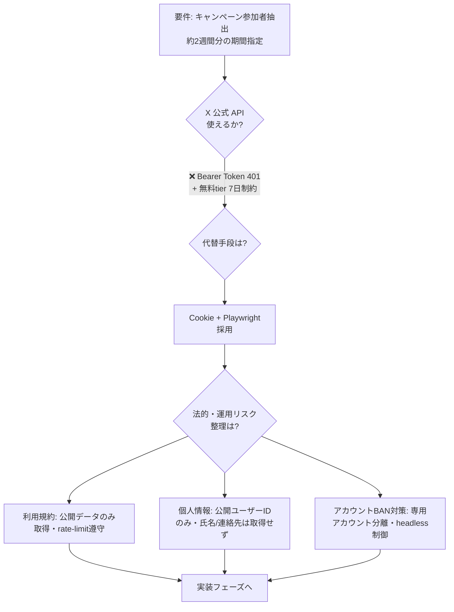
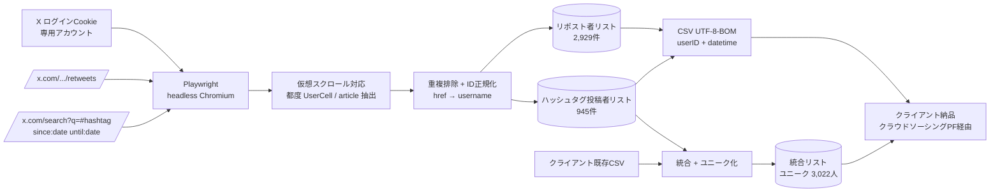

# Case 02: X リポスト・ハッシュタグ投稿者抽出

## 案件概要

| 項目 | 内容 |
|------|------|
| クライアント | 個人事業主B様（SNSキャンペーン運営） |
| 受注経路 | クラウドソーシングPF |
| 金額 | 受注¥44,000 |
| 納期 | 受注から48時間以内 |
| 規模 | リポスト約3,200件 + ハッシュタグ約3,000件 → 最終 3,022人ユニーク参加者 |
| 目的 | キャンペーン参加者の特定（リポスト + ハッシュタグ投稿） |

## 設計判断（最大の論点）

> **API採用 → 失敗 → 代替手段への乗換え**を初期24時間で判断・切替えた案件

## システム構成図

## 技術スタック

| 層 | 技術 |
|----|------|
| 言語 | Python 3.12 |
| ブラウザ自動化 | Playwright（headless Chromium） |
| 認証 | X ログインCookie（専用アカウント分離） |
| 出力 | CSV（UTF-8-BOM / Excel互換） |
| 実行環境 | ローカル WSL2（48時間納期のため迅速性優先） |

## 設計上のポイント

- **API → スクレイピング切替の判断軸**:
  - X 公式 API の Bearer Token が 401 を返し、再発行も無料 tier では 7日超のデータ取得が不可
  - 納期48時間という制約下で API 復旧を待たず、Cookie + Playwright 方式へ即切替
  - スクレイピング採用にあたり、利用規約・個人情報保護・アカウントBAN対策を事前にクライアントへ整理して提示

- **仮想スクロール対応**:
  - X の検索/リポスト一覧は仮想スクロール（古い要素がDOMから削除）
  - `[data-testid="UserCell"]` / `article[data-testid="tweet"]` をスクロール都度抽出
  - 終端判定: 5回連続で新要素ゼロ

- **要件曖昧 → 言語化**:
  - クライアント要望「キャンペーン参加者の特定」を3軸に分解
    - 対象ツイートID
    - 対象ハッシュタグ
    - 期間（約10日間）
  - 出力フォーマットは ① 期間内のみ／② 全期間 + 日時付き の2案を提示し、②で合意取得

- **クライアント既存データとの統合**:
  - 全角＃投稿はXのアルゴリズムでフィルタされる可能性 → クライアント既存CSVと統合してハッシュタグ列を増強

## 解決した技術的課題

| 課題 | 解決策 |
|------|--------|
| `href_to_username()` が `@search?q=...` を偽ユーザーIDとして抽出 | `parts[0].split("?")[0].split("#")[0]` でクエリ・フラグメント除去後にRESERVEDチェック |
| 全角＃投稿の取得漏れ | クライアント既存CSVと統合してカバレッジ補完（標準フローとして文書化） |
| 取得日時 = リポスト時刻ではない可能性 | クライアントへ仕様を事前共有し、日時の意味を明示 |

## 法的・運用上の留意点（事前整理してクライアント合意取得）

- 公開ツイート/公開ユーザーIDのみ取得（DM・非公開アカウントには非接触）
- rate-limit を意図的に遵守（短時間大量アクセスは行わない）
- 個人情報保護法上、公開ユーザーIDは個人情報に該当しない範囲で運用
- 利用規約上のグレー領域は事前にクライアントへ書面提示し合意取得
