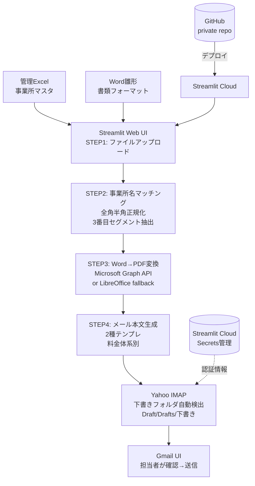

# Case 03: 帳票自動生成 + メール下書き一括保存

## 案件概要

| 項目 | 内容 |
|------|------|
| クライアント | 社労士事務所A様（業種非公開） |
| 受注経路 | クラウドソーシングPF |
| 規模 | 受注¥98,000（追加機能¥11,000）+ 保守 |
| 課題 | Excelで管理する数百件の事業所宛に、定型書類を毎月手作業で作成・印刷・郵送していた。書類は事業所ごとに内容が異なり、人的ミスが頻発 |
| 提供価値 | Excel管理データ + 雛形書類 → 事業所別書類自動生成 → Word→PDF変換 → メール下書き一括保存（Yahoo IMAP）の一気通貫自動化 |
| 工数 | 設計2日 / 実装7日 / 検証3日（計12日） |

## システム構成図

## 技術スタック

| レイヤ | 技術 |
|-------|------|
| Web UI | Streamlit（4ステップウィザード形式） |
| データ処理 | pandas / openpyxl（Excel読込・AR列など特定列指定） |
| 文書変換 | python-docx（Word操作）/ Microsoft Graph API（高品質PDF変換）/ LibreOffice fallback |
| マッチング | 全角半角正規化（NFKC）+ ファイル名セグメント分割 |
| メール | imaplib（Yahoo Japan IMAP）/ MIME（RFC2047・RFC2231 3形式エンコード） |
| デプロイ | Streamlit Community Cloud（無料枠）/ GitHub private repo |
| 認証 | Streamlit Secrets（toml形式・日本語キー対応） |

## 設計上のポイント

- **4ステップウィザードUI**: 非エンジニアでも迷わない順序強制。アップロード → マッチング確認 → PDF変換オプション選択 → メール本文プレビュー → 下書き保存
- **下書きフォルダ動的検出**: Yahoo IMAPでフォルダ名が `Draft`/`Drafts`/`下書き` のいずれかに揺れる → 起動時に list → 候補から自動選択。固定値ハードコードを排除
- **PDF変換のフォールバック設計**: Microsoft Graph API（OneDrive経由）が最高品質だが認証情報未到達時のため、LibreOffice CLI を fallback として常時利用可能に
- **完全クラウド化**: ローカル依存ゼロ・Streamlit Cloud + Yahoo IMAP（外部）で完結。担当者が出張・休暇でも動く
- **添付ファイル仕様**: 日本語ファイル名のIMAP添付は **RFC2047 + RFC2231 + ASCIIフォールバック** の3形式同時付与必須（Yahoo Japan のWebUIで "Untitled" 化を防ぐ）

## 解決した技術的課題

| 課題 | 解決策 |
|------|--------|
| Yahoo Japan の海外IPブロック（2025年導入） | 設定→海外からのアクセス制限を**無効化**（Yahoo Japan にアプリパスワード機能はないため、通常PWを直接使用） |
| Word→PDF 変換品質のばらつき | 第一候補 Microsoft Graph API（OneDrive経由）/ 第二候補 LibreOffice CLI / Pythonライブラリ単独は採用せず |
| メール本文の料金体系別出し分け | テンプレート2種（通常 / 特殊）+ 動的差し込みフィールド（締切月 = 更新月 - 1 で自動算出） |
| 「下書きされない」報告の原因切り分け | エラーパターン辞書化（AUTHENTICATIONFAILED / APPEND returned NO / Connection系）→ 担当者が見ても自己解決可能に |
| 大量ファイルアップロード時のUI応答性 | Streamlit の進捗バー + 個別ファイル状況リアルタイム更新 |

## 運用継続中の追加対応例

- 見本ファイル添付機能の追加（クライアント側で書類フォーマット例示を求められた）
- メール添付PDF + Word の2ファイル同時対応（クライアント要望でPDF＋編集可能Wordの両方を下書きに）
- テンプレ変数のマスク強化（全項目漏れ防止のための pre-validation）

## NDA・契約面

- ソースコードは全て private repo で管理（社外公開なし）
- クライアント固有のExcelフォーマット情報・宛先データは share せず、設計思想と技術スタックのみを本Caseで開示
- 認証情報は Streamlit Secrets / 環境変数経由のみ・コード直書きなし
